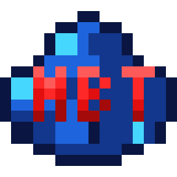
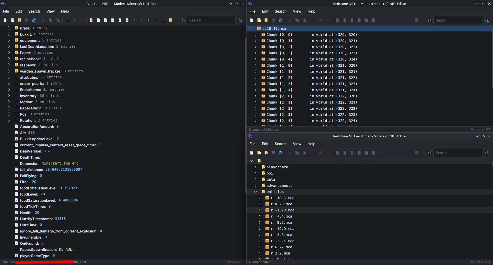
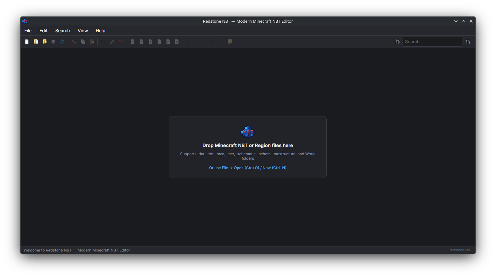

# Redstone NBT

<div align="center">



### Modern, High-Performance, Cross-Platform Minecraft NBT & World Editor

[](https://github.com/Raul1x9/RedstoneNBT/releases)
[](https://github.com/Raul1x9/RedstoneNBT/releases)
[](LICENSE)
[](https://dotnet.microsoft.com/)
[](https://avaloniaui.net/)
[](#installation--downloads)

</div>

---

## 📖 Overview

**Redstone NBT** is a rejuvenated, desktop-grade Minecraft NBT and region file editor built from the ground up for modern operating systems. It is directly based on Justin Aquadro's legendary **NBTExplorer** and **Substrate** codebase, upgraded to **.NET 10** and **Avalonia UI** for cross-platform responsiveness on **Linux (Wayland & X11)**, **Windows 10/11**, and **macOS (Apple Silicon & Intel)**.

Whether you are debugging custom worlds, inspecting chunk sections in Anvil `.mca` files, editing player data `.dat` files, or tweaking Bedrock `.mcstructure` templates, **Redstone NBT** delivers native performance with zero lag and modern UI ergonomics.

---

## 📸 Screenshots

<div align="center">

### Multi-View Editing: NBT Tags, Region Chunks (.mca), and World Folders


<br/><br/>

### Sleek Dark Theme & Drag-and-Drop Drop Zone


</div>

---

## ✨ Key Features & Modern Improvements

- 🗂️ **Custom View & Authentic NBTExplorer Sorting**: Group containers first just like classic NBTExplorer (Compounds first, Lists second, Scalars third, Arrays fourth), or switch on the fly via the **View** menu to *Alphabetical*, *By Tag Type*, or *File Order*.
- 📥 **Seamless Drag & Drop**: Drag and drop any Minecraft NBT files, region files, or entire world folders directly anywhere onto the window to open them immediately (single or multiple items simultaneously).
- ⚡ **In-Place Inline Value Editing**: Click any scalar tag value (or press `Enter` / `F2`) to edit values directly within the tree view row — no more annoying modal popups for simple integer, float, or string adjustments.
- 🎨 **Context-Aware Dynamic Toolbar**: Tools automatically gray out and disable when not applicable (e.g. invalid tag additions on typed lists, editing non-scalar containers, or saving when no changes exist).
- 💾 **Reactive Unsaved State Indicator**: The floppy disk icon dims when clean and lights up dynamically as soon as any open file, chunk, or tag is modified.
- 📁 **New NBT File Creation (`Ctrl+N`)**: Create fresh uncompressed (`.nbt`), GZip-compressed (`.dat`), or Zlib-compressed NBT files directly with format selection and root Compound initialization.
- 🔍 **Integrated High-Speed Search**: Fast, background search with on-demand results panel and smooth auto-expansion and scrolling straight to matching tags.
- 🌐 **Universal Format Support**: Full backward and forward compatibility with legacy McRegion (`.mcr`), Anvil (`.mca` up through 1.21+), and Bedrock Little-Endian structures (`.mcstructure`, Bedrock `level.dat`).
- 💎 **Authentic Pixel-Art Design**: Rejuvenated Minecraft-authentic aesthetic with a custom lapis-blue redstone dust icon and stylish red "NBT" lettering.

---

## 🗂️ Supported Data Formats

| Format | Extensions | Description |
|---|---|---|
| **Java Region Files** | `.mca`, `.mcr` | Anvil & McRegion world chunks (compression versions 1, 2, and 3 uncompressed) |
| **Java NBT Data Files** | `.dat`, `.dat_old`, `.dat_mcr` | `level.dat`, player data, advancements, maps, scoreboard, village/raid data |
| **Structure Files** | `.nbt` | Minecraft vanilla structure templates and custom exports |
| **Schematics** | `.schematic`, `.schem` | MCEdit, WorldEdit, and Sponge schematic files |
| **Bedrock Structures** | `.mcstructure` | Minecraft Bedrock Little-Endian structure exports |
| **Bedrock World Data** | `level.dat` | Bedrock `level.dat` with 8-byte header auto-detection and LE decoding |

---

## ⌨️ Keyboard Shortcuts

| Shortcut | Action | Description |
|---|---|---|
| `Ctrl + N` | **New File** | Create a new NBT file with format selection |
| `Ctrl + O` | **Open File** | Open any supported Minecraft NBT or Region file |
| `Ctrl + Shift + O` | **Open Folder** | Open an entire world directory or save folder |
| `Ctrl + S` | **Save All** | Save all modified open files and chunks |
| `Ctrl + Shift + S` | **Save As** | Export current NBT tree to a new file |
| `F5` | **Refresh** | Reload active node or all roots from disk |
| `Ctrl + E` / `Enter` | **Edit Value** | Edit scalar tag value in-place |
| `Ctrl + R` / `F2` | **Rename** | Rename selected tag |
| `Delete` | **Delete** | Delete selected tag or node |
| `Ctrl + X` | **Cut** | Cut selected tag to clipboard |
| `Ctrl + C` | **Copy** | Copy selected tag to clipboard |
| `Ctrl + V` | **Paste** | Paste tag into selected container |
| `Ctrl + Up` / `Down` | **Reorder** | Move tag up/down inside ordered lists |
| `Ctrl + F` | **Find** | Focus search input |
| `F3` | **Find Next** | Jump to next search result |

---

## 🚀 Installation & Downloads

Pre-compiled standalone releases for all major platforms and CPU architectures (x86_64 & ARM64) are available on the [GitHub Releases Page](https://github.com/Raul1x9/RedstoneNBT/releases).

### 🐧 Linux

#### Option 1: Debian / Ubuntu (`.deb`)
Download the `.deb` package matching your architecture:
- **x86_64 (Intel/AMD)**: `redstone-nbt_1.0.0_amd64.deb`
- **ARM64 (Raspberry Pi, Ampere, etc.)**: `redstone-nbt_1.0.0_arm64.deb`

Install using `apt`:
```bash
sudo apt install ./redstone-nbt_1.0.0_amd64.deb
# or on ARM64:
# sudo apt install ./redstone-nbt_1.0.0_arm64.deb
```
This automatically registers Redstone NBT in your desktop application launcher (GNOME, KDE Plasma, XFCE, etc.) with desktop icon and MIME file associations.

#### Option 2: Portable Tarball (`.tar.gz`)
Works on any Linux distribution (Arch, Fedora, openSUSE, Debian, etc.):
```bash
# For x86_64:
tar -xzf redstone-nbt-1.0.0-linux-x64.tar.gz
cd redstone-nbt-1.0.0-linux-x64
./redstone-nbt

# For ARM64:
tar -xzf redstone-nbt-1.0.0-linux-arm64.tar.gz
cd redstone-nbt-1.0.0-linux-arm64
./redstone-nbt
```

---

### 🪟 Windows

Available for both 64-bit Intel/AMD and ARM64 Windows PCs:
- **x86_64**: `redstone-nbt-1.0.0-win-x64.zip`
- **ARM64**: `redstone-nbt-1.0.0-win-arm64.zip`

1. Download the `.zip` archive for your CPU.
2. Extract the folder anywhere on your computer.
3. Double-click `redstone-nbt.exe` (or `RedstoneNBT.exe`) to launch immediately. No installer required!

---

### 🍎 macOS

Native application bundles (`.app`) packaged as archives:
- **Apple Silicon (M1 / M2 / M3 / M4)**: `redstone-nbt-1.0.0-osx-arm64.tar.gz`
- **Intel Macs (x86_64)**: `redstone-nbt-1.0.0-osx-x64.tar.gz`

1. Download the archive for your Mac.
2. Extract it to get `Redstone NBT.app`.
3. Drag `Redstone NBT.app` to your `/Applications` folder and double-click to run.

---

## 🛠️ Building from Source

### Prerequisites
- [.NET 10.0 SDK](https://dotnet.microsoft.com/download/dotnet/10.0)

### Clone & Build
```bash
git clone https://github.com/Raul1x9/RedstoneNBT.git
cd RedstoneNBT

# Restore and build the entire solution
dotnet build RedstoneNBT.sln

# Run directly
dotnet run --project src/RedstoneNBT/RedstoneNBT.csproj
```

### Packaging All Distributions
To cross-compile and generate all release archives (`.tar.gz`, `.zip`, `.deb`):
```bash
./packaging/build_packages.sh
```

---

## 📜 License & Credits

- **Author & Maintainer**: Raul1x9 ([@Raul1x9](https://github.com/Raul1x9)) & Redstone NBT Contributors.
- **Original Upstream Author**: Justin Aquadro ([@jaquadro](https://github.com/jaquadro)), creator of the original [NBTExplorer](https://github.com/jaquadro/NBTExplorer) and [Substrate](https://github.com/jaquadro/Substrate) library (licensed under MIT).
- **License**: Released under the **[GNU General Public License v3.0 (GPLv3)](LICENSE)**.

```text
Copyright (C) 2026 Raul1x9 and Redstone NBT Contributors
Copyright (C) 2011 Justin Aquadro (NBTExplorer & Substrate upstream components)
```
